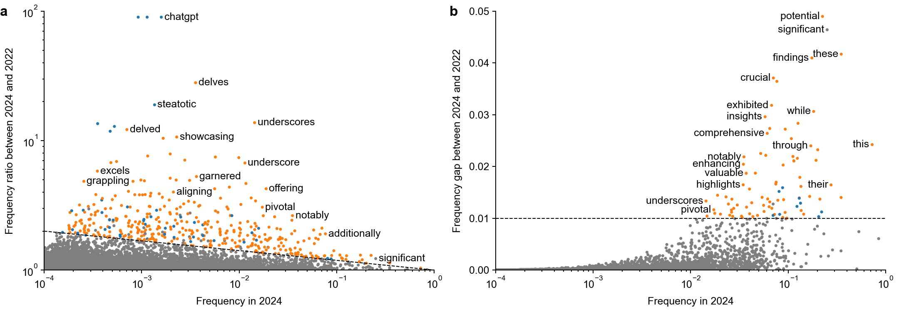

# Delving into ChatGPT usage in academic writing through excess vocabulary



Analysis code for the paper [Kobak et al. 2024, Delving into ChatGPT usage in academic writing through excess vocabulary](https://arxiv.org/abs/2406.07016).

How to cite:
```
@article{kobak2024delving,
  title={Delving into {ChatGPT} usage in academic writing through excess vocabulary},
  author={Kobak, Dmitry and Gonz\'alez-M\'arquez, Rita and Horv\'at, Em\H{o}ke-\'Agnes and Lause, Jan},
  journal={arXiv preprint arXiv:2406.07016},
  year={2024}
}
```

All excess words that we identified from 2013 to 2024 are listed in `results/excess_words.csv` together with our annotations.

## Instructions

1. All excess frequency analysis and all figures shown in the paper (and provided in the `figures/` folder) are produced by the `scripts/figures.ipynb` Python notebook. This notebook takes as the input a Pickle file with yearly counts of each word (which is too large to be provided here) and several other files with yearly counts of word groups (`yearly-counts*`). The notebook only takes a minute to run.
2. These yearly word count files are produced by the `scripts/preprocess-and-count.py` script which takes a few hours to run and needs a lot of memory. This script takes CSV files with abstract texts as input, performs abstracts cleaning via regular expressions (~1 hour), then runs `sklearn.feature_extraction.text.CountVectorizer(binary=True).fit_transform(df.AbstractText.values)` (~0.5 hours), and then does yearly aggregation.
3. The input to the `scripts/preprocess-and-count.py` script are three files: `pubmed_landscape_data_2024_v2.zip` and `pubmed_landscape_abstracts_2024.zip` containing PubMed data from the end-of-2023 baseline, available at https://zenodo.org/doi/10.5281/zenodo.7695389 associated with our _Patterns_ paper (https://www.cell.com/patterns/fulltext/S2666-3899(24)00076-X) _The landscape of biomedical research_; and `pubmed_daily_updates_2024_v2.zip` containg PubMed data from January--June 2024.
4. This last file is constructed by the `scripts/process-daily-updates.ipynb` notebook that takes all daily XML files from https://ftp.ncbi.nlm.nih.gov/pubmed/updatefiles/ until 2024-06-30 (from `pubmed24n1220.xml.gz` to `pubmed24n1456.xml.gz`) as input.
